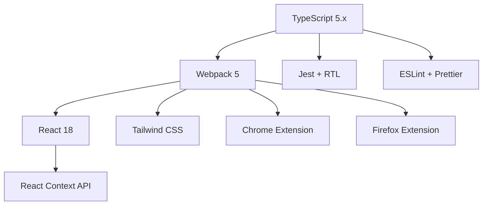
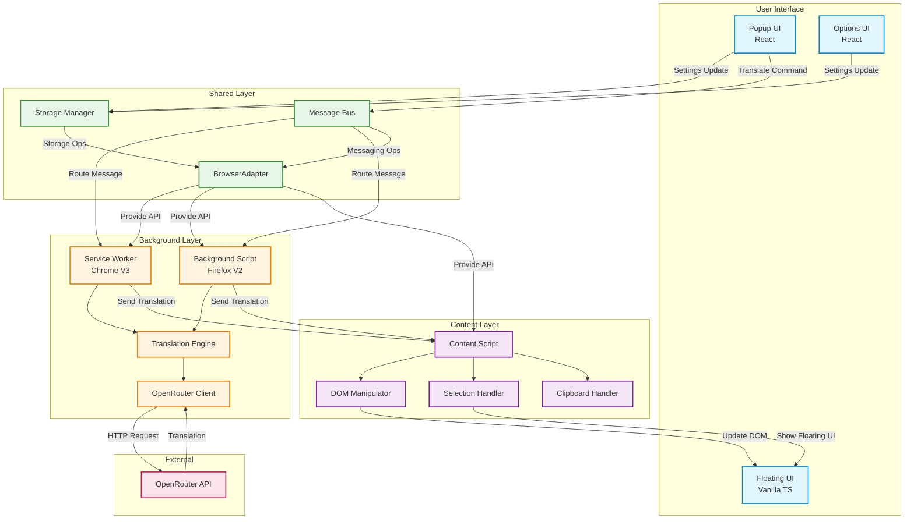
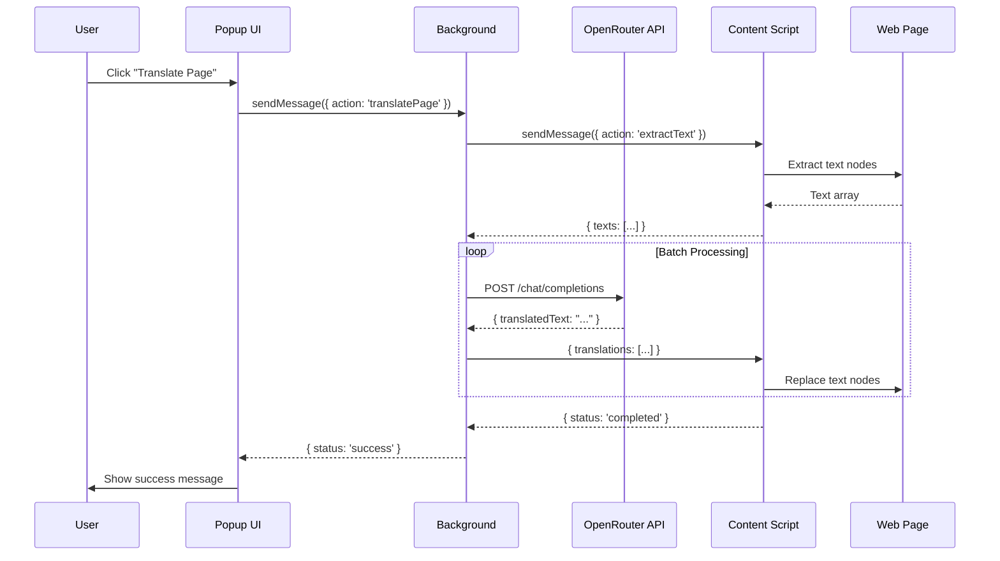
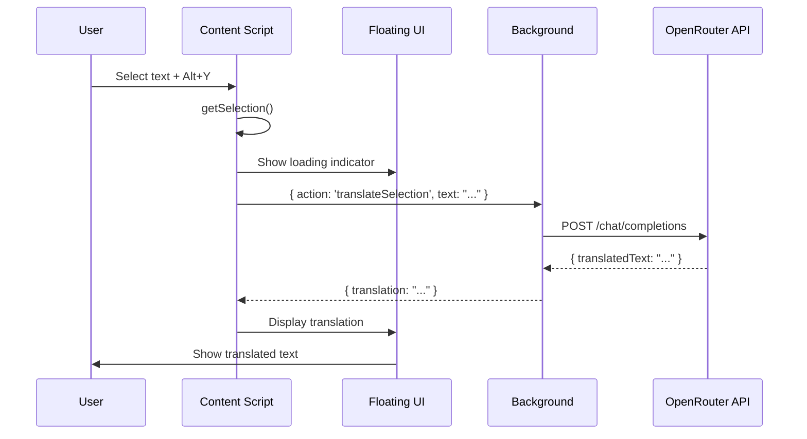
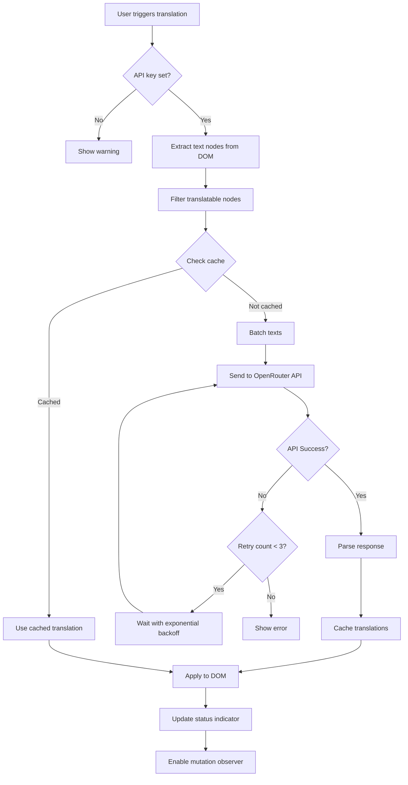
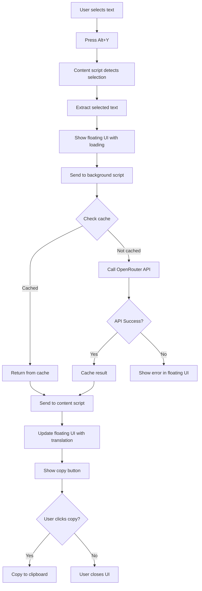

# ARCHITECTURE.md

> **DoganayLab API Translate App** - TypeScript/React リアーキテクチャ設計書

## 目次

1. [プロジェクト概要](#1-プロジェクト概要)
2. [技術スタック](#2-技術スタック)
3. [ディレクトリ構造](#3-ディレクトリ構造)
4. [アーキテクチャ設計](#4-アーキテクチャ設計)
5. [コアコンポーネント仕様](#5-コアコンポーネント仕様)
6. [翻訳フロー](#6-翻訳フロー)
7. [クロスブラウザ戦略](#7-クロスブラウザ戦略)
8. [ビルド・デプロイプロセス](#8-ビルドデプロイプロセス)
9. [テスト戦略](#9-テスト戦略)
10. [マイグレーション計画](#10-マイグレーション計画)
11. [パフォーマンス・最適化](#11-パフォーマンス最適化)
12. [セキュリティ考慮事項](#12-セキュリティ考慮事項)

---

## 1. プロジェクト概要

### 1.1 プロジェクト名・目的

**名称**: DoganayLab API Translate App (geminitranslate v3.0)

**目的**:
- OpenRouter API を活用した Web ページ全体翻訳
- 選択テキストのインライン翻訳
- TypeScript + React による保守性・拡張性の向上
- Chrome (Manifest V3) / Firefox (Manifest V2) のクロスブラウザ対応

### 1.2 現行実装との差分

| 項目 | 現行 (v2.x) | 新規 (v3.0) |
|------|-------------|-------------|
| 言語 | Plain JavaScript | **TypeScript 5.x** |
| ビルドツール | bash + web-ext | **Webpack 5** |
| UI フレームワーク | Vanilla JS | **React 18** |
| Manifest | V2 (手動 V3 変換) | **V3/V2 自動切替** |
| 状態管理 | 直接 Storage API | **React Context + Hooks** |
| テスト | Jest (部分的) | **Jest + RTL (包括的)** |
| API クライアント | 手動実装 | **モジュール化 (OpenRouterClient.ts)** |
| 設定 UI | 素の HTML/CSS | **React コンポーネント + Tailwind** |

**主な機能継承**:
- ✅ ページ全体翻訳 (Alt+W)
- ✅ 選択テキスト翻訳 (Alt+Y)
- ✅ クリップボード翻訳 (Alt+C)
- ✅ OpenRouter API 統合
- ✅ 複数 AI モデル対応
- ✅ フォントサイズ・行高調整

**新規機能追加**:
- ⚡ Service Worker 対応 (Chrome)
- 🎨 モダンな設定 UI (React)
- 🧪 包括的テストカバレッジ
- 📦 効率的なバンドル管理

---

## 2. 技術スタック

### 2.1 採用技術一覧



| カテゴリ | 技術 | バージョン | 選定理由 |
|---------|------|-----------|---------|
| **言語** | TypeScript | 5.x | 型安全性、IDE サポート、リファクタリング容易性 |
| **ビルド** | Webpack | 5.x | read-aloud-tab で実績あり、拡張機能ビルドに特化 |
| **UI** | React | 18.x | コンポーネント再利用、状態管理の標準化 |
| **スタイリング** | Tailwind CSS | 3.x | 高速開発、一貫性のあるデザイン |
| **状態管理** | React Context | - | 小〜中規模に適切、Redux は過剰 |
| **テスト** | Jest + RTL | 30.x | read-aloud-tab で実績、React との親和性 |
| **Linter** | ESLint | 9.x | コード品質維持 |
| **フォーマッタ** | Prettier | - | コードスタイル統一 |

### 2.2 選定理由詳細

#### TypeScript 5.x
```typescript
// 型安全な API レスポンス定義
interface TranslationResponse {
  translatedText: string;
  sourceLanguage: string;
  confidence: number;
}

// ブラウザ API のラッパー型定義
type BrowserStorage = {
  get: <T extends StorageKeys>(keys: T[]) => Promise<StorageData<T>>;
  set: (data: Partial<StorageData>) => Promise<void>;
};
```

**メリット**:
- コンパイル時エラー検出 → ランタイムバグ削減
- IDE の自動補完・リファクタリング支援
- 大規模化に対応可能

#### Webpack 5
```javascript
// webpack.config.js の基本構造
module.exports = (env) => ({
  entry: {
    background: './src/background/service.ts',
    content: './src/content/index.ts',
    popup: './src/popup/index.tsx',
    options: './src/options/index.tsx',
  },
  output: {
    path: path.resolve(__dirname, `dist-${env.browser}`),
    filename: '[name].js',
  },
  // Chrome/Firefox 向けに動的設定切替
});
```

**read-aloud-tab での実績**:
- Chrome/Firefox のビルド自動切替
- Tree-shaking による最適化
- Code-splitting によるパフォーマンス向上

#### React 18 + Context API
```tsx
// 設定管理の Context 例
const SettingsContext = createContext<SettingsContextType>(null);

export const SettingsProvider: React.FC = ({ children }) => {
  const [settings, setSettings] = useState<Settings>(defaultSettings);

  useEffect(() => {
    BrowserAdapter.storage.get(['targetLanguage', 'fontSize']).then(setSettings);
  }, []);

  return (
    <SettingsContext.Provider value={{ settings, setSettings }}>
      {children}
    </SettingsContext.Provider>
  );
};
```

**メリット**:
- コンポーネント再利用性 (Popup/Options で共通 UI)
- 状態管理の一元化
- テスト可能性の向上

---

## 3. ディレクトリ構造

### 3.1 完全なプロジェクト構造

```
geminitranslate/
├── src/
│   ├── background/
│   │   ├── service.ts                 # Service Worker エントリポイント (Chrome)
│   │   ├── background.ts              # Persistent Background (Firefox)
│   │   ├── translationEngine.ts       # 翻訳エンジン本体
│   │   ├── apiClient.ts               # OpenRouter API クライアント
│   │   ├── messageHandler.ts          # メッセージルーティング
│   │   ├── commandHandler.ts          # キーボードショートカット処理
│   │   └── keepAlive.ts               # Chrome Service Worker 維持機構
│   │
│   ├── content/
│   │   ├── index.ts                   # Content Script エントリポイント
│   │   ├── domManipulator.ts          # DOM 操作・翻訳適用
│   │   ├── selectionHandler.ts        # 選択テキスト処理
│   │   ├── clipboardHandler.ts        # クリップボード処理
│   │   ├── mutationObserver.ts        # 動的コンテンツ監視
│   │   ├── floatingUI.ts              # 選択時の浮動 UI
│   │   └── cache.ts                   # 翻訳キャッシュ管理
│   │
│   ├── popup/
│   │   ├── index.tsx                  # Popup エントリポイント
│   │   ├── App.tsx                    # Popup メインコンポーネント
│   │   ├── components/
│   │   │   ├── QuickTranslate.tsx     # クイック翻訳ボタン
│   │   │   ├── LanguageSelector.tsx   # 言語選択
│   │   │   ├── StatusIndicator.tsx    # 翻訳状態表示
│   │   │   └── ApiKeyWarning.tsx      # API キー未設定警告
│   │   └── hooks/
│   │       ├── useTranslation.ts      # 翻訳実行フック
│   │       └── useSettings.ts         # 設定取得フック
│   │
│   ├── options/
│   │   ├── index.tsx                  # Options ページエントリポイント
│   │   ├── App.tsx                    # Options メインコンポーネント
│   │   ├── components/
│   │   │   ├── ApiSettings.tsx        # API 設定セクション
│   │   │   ├── ModelSelector.tsx      # モデル選択
│   │   │   ├── LanguageSettings.tsx   # 言語設定
│   │   │   ├── AppearanceSettings.tsx # 外観設定
│   │   │   └── ConnectionTest.tsx     # 接続テスト
│   │   └── hooks/
│   │       └── useSettings.ts         # 設定管理フック
│   │
│   ├── shared/
│   │   ├── adapters/
│   │   │   └── BrowserAdapter.ts      # Chrome/Firefox API 統一
│   │   ├── storage/
│   │   │   ├── StorageManager.ts      # Storage 抽象化
│   │   │   └── types.ts               # Storage 型定義
│   │   ├── messages/
│   │   │   ├── MessageBus.ts          # メッセージング抽象化
│   │   │   └── types.ts               # メッセージ型定義
│   │   ├── utils/
│   │   │   ├── logger.ts              # ロギングユーティリティ
│   │   │   ├── retry.ts               # リトライロジック
│   │   │   └── languageDetector.ts    # 言語検出
│   │   ├── constants/
│   │   │   ├── languages.ts           # サポート言語定義
│   │   │   ├── models.ts              # AI モデル定義
│   │   │   └── config.ts              # グローバル設定
│   │   └── types/
│   │       ├── translation.ts         # 翻訳関連型
│   │       ├── api.ts                 # API 関連型
│   │       └── storage.ts             # ストレージ型
│   │
│   └── styles/
│       ├── globals.css                # グローバルスタイル
│       └── tailwind.css               # Tailwind 設定
│
├── public/
│   ├── manifest.v2.json               # Firefox Manifest
│   ├── manifest.v3.json               # Chrome Manifest
│   ├── icons/                         # アイコン群
│   ├── popup.html                     # Popup HTML
│   └── options.html                   # Options HTML
│
├── tests/
│   ├── unit/
│   │   ├── background/
│   │   │   ├── translationEngine.test.ts
│   │   │   └── apiClient.test.ts
│   │   ├── content/
│   │   │   ├── domManipulator.test.ts
│   │   │   └── selectionHandler.test.ts
│   │   └── shared/
│   │       └── BrowserAdapter.test.ts
│   ├── integration/
│   │   ├── translation-flow.test.ts
│   │   └── settings-sync.test.ts
│   └── fixtures/
│       ├── mockResponses.ts
│       └── testPages.html
│
├── webpack/
│   ├── webpack.common.js              # 共通設定
│   ├── webpack.chrome.js              # Chrome 専用設定
│   ├── webpack.firefox.js             # Firefox 専用設定
│   └── plugins/
│       ├── ManifestPlugin.js          # Manifest 生成プラグイン
│       └── ZipPlugin.js               # 配布用 ZIP 生成
│
├── scripts/
│   ├── build.sh                       # ビルドスクリプト
│   ├── dev.sh                         # 開発サーバー起動
│   └── test.sh                        # テスト実行
│
├── package.json
├── tsconfig.json
├── jest.config.ts
├── tailwind.config.js
├── .eslintrc.js
├── .prettierrc
└── README.md
```

### 3.2 主要ディレクトリの責務

| ディレクトリ | 責務 |
|------------|------|
| **src/background/** | バックグラウンド処理全般 (API 通信、コマンド処理) |
| **src/content/** | Web ページ内での DOM 操作・翻訳適用 |
| **src/popup/** | クイック翻訳 UI (ブラウザアクションポップアップ) |
| **src/options/** | 詳細設定 UI (オプションページ) |
| **src/shared/** | 全コンポーネントで共有されるコード |
| **webpack/** | ビルド設定 (Chrome/Firefox 別) |
| **tests/** | ユニット・統合テスト |

---

## 4. アーキテクチャ設計

### 4.1 コンポーネント相互作用図



### 4.2 データフロー

#### 4.2.1 ページ翻訳フロー



#### 4.2.2 選択翻訳フロー



### 4.3 Chrome vs Firefox 実装差分

| 機能 | Chrome (Manifest V3) | Firefox (Manifest V2) |
|------|---------------------|----------------------|
| **Background** | Service Worker (一時的) | Persistent Background Page |
| **Keep-Alive** | Offscreen Document 利用 | 不要 |
| **Storage API** | `chrome.storage.local` | `browser.storage.local` |
| **Messaging API** | `chrome.runtime.sendMessage` | `browser.runtime.sendMessage` |
| **Polyfill** | 不要 | `webextension-polyfill` |
| **CSP** | `script-src 'self'` | より柔軟 |

**BrowserAdapter による吸収例**:

```typescript
// src/shared/adapters/BrowserAdapter.ts
class BrowserAdapter {
  get storage() {
    const api = typeof chrome !== 'undefined' ? chrome : browser;
    return {
      get: <T>(keys: string[]) => api.storage.local.get(keys) as Promise<T>,
      set: (data: object) => api.storage.local.set(data),
    };
  }

  get runtime() {
    const api = typeof chrome !== 'undefined' ? chrome : browser;
    return {
      sendMessage: (message: any) => api.runtime.sendMessage(message),
      onMessage: api.runtime.onMessage,
    };
  }
}

export default new BrowserAdapter();
```

---

## 5. コアコンポーネント仕様

### 5.1 Background Script (service.ts / background.ts)

**責務**:
- メッセージルーティング
- キーボードコマンド処理
- Chrome Service Worker の維持

```typescript
// src/background/service.ts (Chrome)
import { MessageHandler } from './messageHandler';
import { CommandHandler } from './commandHandler';
import { KeepAlive } from './keepAlive';

class BackgroundService {
  private messageHandler: MessageHandler;
  private commandHandler: CommandHandler;
  private keepAlive: KeepAlive;

  constructor() {
    this.messageHandler = new MessageHandler();
    this.commandHandler = new CommandHandler();
    this.keepAlive = new KeepAlive(); // Chrome 専用

    this.init();
  }

  private init(): void {
    // Message listener
    chrome.runtime.onMessage.addListener((message, sender, sendResponse) => {
      this.messageHandler.handle(message, sender, sendResponse);
      return true; // Async response
    });

    // Command listener
    chrome.commands.onCommand.addListener((command) => {
      this.commandHandler.handle(command);
    });

    // Keep-alive for Chrome Service Worker
    this.keepAlive.start();
  }
}

new BackgroundService();
```

```typescript
// src/background/background.ts (Firefox)
import { MessageHandler } from './messageHandler';
import { CommandHandler } from './commandHandler';

class BackgroundScript {
  private messageHandler: MessageHandler;
  private commandHandler: CommandHandler;

  constructor() {
    this.messageHandler = new MessageHandler();
    this.commandHandler = new CommandHandler();

    this.init();
  }

  private init(): void {
    browser.runtime.onMessage.addListener((message, sender) => {
      return this.messageHandler.handle(message, sender, () => {});
    });

    browser.commands.onCommand.addListener((command) => {
      this.commandHandler.handle(command);
    });
  }
}

new BackgroundScript();
```

### 5.2 Translation Engine (translationEngine.ts)

**責務**:
- テキスト抽出・前処理
- バッチ処理
- 翻訳キャッシュ管理

```typescript
// src/background/translationEngine.ts
import { OpenRouterClient } from './apiClient';
import { StorageManager } from '../shared/storage/StorageManager';
import { retry } from '../shared/utils/retry';

export class TranslationEngine {
  private apiClient: OpenRouterClient;
  private cache: Map<string, string> = new Map();
  private readonly BATCH_SIZE = 10;

  constructor() {
    this.apiClient = new OpenRouterClient();
  }

  async translateBatch(
    texts: string[],
    targetLanguage: string
  ): Promise<string[]> {
    const uncachedIndices: number[] = [];
    const results: string[] = new Array(texts.length);

    // キャッシュチェック
    texts.forEach((text, index) => {
      const cacheKey = `${text}:${targetLanguage}`;
      if (this.cache.has(cacheKey)) {
        results[index] = this.cache.get(cacheKey)!;
      } else {
        uncachedIndices.push(index);
      }
    });

    // 未キャッシュのテキストを翻訳
    if (uncachedIndices.length > 0) {
      const uncachedTexts = uncachedIndices.map(i => texts[i]);
      const translations = await this.translateWithRetry(
        uncachedTexts,
        targetLanguage
      );

      uncachedIndices.forEach((originalIndex, i) => {
        results[originalIndex] = translations[i];
        const cacheKey = `${texts[originalIndex]}:${targetLanguage}`;
        this.cache.set(cacheKey, translations[i]);
      });
    }

    return results;
  }

  private async translateWithRetry(
    texts: string[],
    targetLanguage: string
  ): Promise<string[]> {
    return retry(
      async () => this.apiClient.translate(texts, targetLanguage),
      { maxRetries: 3, delay: 1000 }
    );
  }

  clearCache(): void {
    this.cache.clear();
  }
}
```

### 5.3 OpenRouter API Client (apiClient.ts)

**責務**:
- OpenRouter API への HTTP リクエスト
- レート制限処理
- エラーハンドリング

```typescript
// src/background/apiClient.ts
import { StorageManager } from '../shared/storage/StorageManager';
import { logger } from '../shared/utils/logger';

interface OpenRouterConfig {
  apiKey: string;
  model: string;
  provider?: string;
}

export class OpenRouterClient {
  private readonly API_ENDPOINT = 'https://openrouter.ai/api/v1/chat/completions';
  private config: OpenRouterConfig | null = null;

  async initialize(): Promise<void> {
    const storage = new StorageManager();
    const data = await storage.get(['openRouterApiKey', 'openRouterModel', 'openRouterProvider']);

    this.config = {
      apiKey: data.openRouterApiKey || '',
      model: data.openRouterModel || 'google/gemini-2.0-flash-exp:free',
      provider: data.openRouterProvider,
    };
  }

  async translate(texts: string[], targetLanguage: string): Promise<string[]> {
    if (!this.config) await this.initialize();
    if (!this.config?.apiKey) {
      throw new Error('API key not configured');
    }

    const prompt = this.buildPrompt(texts, targetLanguage);
    const response = await fetch(this.API_ENDPOINT, {
      method: 'POST',
      headers: {
        'Authorization': `Bearer ${this.config.apiKey}`,
        'Content-Type': 'application/json',
        'HTTP-Referer': 'https://github.com/doganaylab/geminitranslate',
      },
      body: JSON.stringify({
        model: this.config.model,
        messages: [
          { role: 'user', content: prompt }
        ],
        provider: this.config.provider ? { order: [this.config.provider] } : undefined,
      }),
    });

    if (!response.ok) {
      const error = await response.json();
      logger.error('OpenRouter API error:', error);
      throw new Error(`API request failed: ${error.error?.message || response.statusText}`);
    }

    const data = await response.json();
    return this.parseResponse(data.choices[0].message.content, texts.length);
  }

  private buildPrompt(texts: string[], targetLanguage: string): string {
    return `Translate the following texts to ${targetLanguage}. Return only the translations, one per line, without numbering:\n\n${texts.join('\n')}`;
  }

  private parseResponse(content: string, expectedCount: number): string[] {
    const lines = content.trim().split('\n').filter(line => line.trim());
    if (lines.length !== expectedCount) {
      logger.warn(`Expected ${expectedCount} translations, got ${lines.length}`);
    }
    return lines;
  }

  async testConnection(): Promise<{ success: boolean; message?: string; error?: string }> {
    try {
      if (!this.config) await this.initialize();

      const result = await this.translate(['Hello'], 'Japanese');
      return {
        success: true,
        message: `Connection successful! Model: ${this.config?.model}`,
      };
    } catch (error) {
      return {
        success: false,
        error: error instanceof Error ? error.message : 'Unknown error',
      };
    }
  }
}
```

### 5.4 Content Script (index.ts)

**責務**:
- DOM 操作
- 選択テキスト検出
- 翻訳適用

```typescript
// src/content/index.ts
import { DOMManipulator } from './domManipulator';
import { SelectionHandler } from './selectionHandler';
import { ClipboardHandler } from './clipboardHandler';
import { MutationObserverManager } from './mutationObserver';
import BrowserAdapter from '../shared/adapters/BrowserAdapter';

class ContentScript {
  private domManipulator: DOMManipulator;
  private selectionHandler: SelectionHandler;
  private clipboardHandler: ClipboardHandler;
  private mutationObserver: MutationObserverManager;

  constructor() {
    this.domManipulator = new DOMManipulator();
    this.selectionHandler = new SelectionHandler();
    this.clipboardHandler = new ClipboardHandler();
    this.mutationObserver = new MutationObserverManager();

    this.init();
  }

  private init(): void {
    // Listen for messages from background
    BrowserAdapter.runtime.onMessage.addListener((message, sender, sendResponse) => {
      this.handleMessage(message, sendResponse);
      return true;
    });

    // Selection handler
    this.selectionHandler.enable();

    // Mutation observer for dynamic content
    this.mutationObserver.observe(document.body);
  }

  private async handleMessage(message: any, sendResponse: Function): Promise<void> {
    switch (message.action) {
      case 'translate':
        await this.handleTranslatePage(message, sendResponse);
        break;
      case 'translateSelection':
        await this.handleTranslateSelection(message, sendResponse);
        break;
      case 'translateClipboard':
        await this.handleTranslateClipboard(message, sendResponse);
        break;
      case 'reset':
        this.domManipulator.reset();
        sendResponse({ status: 'reset' });
        break;
    }
  }

  private async handleTranslatePage(message: any, sendResponse: Function): Promise<void> {
    const textNodes = this.domManipulator.extractTextNodes();
    sendResponse({ status: 'started', count: textNodes.length });

    // Request translation from background
    const response = await BrowserAdapter.runtime.sendMessage({
      action: 'requestTranslation',
      texts: textNodes.map(node => node.textContent || ''),
      targetLanguage: message.targetLanguage,
    });

    if (response.translations) {
      this.domManipulator.applyTranslations(textNodes, response.translations);
    }
  }

  private async handleTranslateSelection(message: any, sendResponse: Function): Promise<void> {
    this.selectionHandler.translateCurrent(message.targetLanguage);
    sendResponse({ status: 'completed' });
  }

  private async handleTranslateClipboard(message: any, sendResponse: Function): Promise<void> {
    const text = await this.clipboardHandler.read();
    if (text) {
      const response = await BrowserAdapter.runtime.sendMessage({
        action: 'requestTranslation',
        texts: [text],
        targetLanguage: message.targetLanguage,
      });
      this.clipboardHandler.showTranslation(response.translations[0]);
    }
    sendResponse({ status: 'completed' });
  }
}

new ContentScript();
```

### 5.5 DOM Manipulator (domManipulator.ts)

```typescript
// src/content/domManipulator.ts
export class DOMManipulator {
  private originalTextMap: WeakMap<Node, string> = new WeakMap();
  private readonly IGNORED_TAGS = ['SCRIPT', 'STYLE', 'NOSCRIPT', 'IFRAME'];

  extractTextNodes(): Node[] {
    const walker = document.createTreeWalker(
      document.body,
      NodeFilter.SHOW_TEXT,
      {
        acceptNode: (node) => {
          const parent = node.parentElement;
          if (!parent) return NodeFilter.FILTER_REJECT;
          if (this.IGNORED_TAGS.includes(parent.tagName)) return NodeFilter.FILTER_REJECT;
          if (!node.textContent?.trim()) return NodeFilter.FILTER_REJECT;
          return NodeFilter.FILTER_ACCEPT;
        }
      }
    );

    const nodes: Node[] = [];
    let node;
    while (node = walker.nextNode()) {
      this.originalTextMap.set(node, node.textContent || '');
      nodes.push(node);
    }
    return nodes;
  }

  applyTranslations(nodes: Node[], translations: string[]): void {
    nodes.forEach((node, index) => {
      if (translations[index]) {
        node.textContent = translations[index];
      }
    });
  }

  reset(): void {
    const walker = document.createTreeWalker(
      document.body,
      NodeFilter.SHOW_TEXT
    );

    let node;
    while (node = walker.nextNode()) {
      const original = this.originalTextMap.get(node);
      if (original) {
        node.textContent = original;
      }
    }
  }
}
```

### 5.6 React UI Components (Popup)

```tsx
// src/popup/App.tsx
import React, { useState, useEffect } from 'react';
import { useSettings } from './hooks/useSettings';
import { useTranslation } from './hooks/useTranslation';
import QuickTranslate from './components/QuickTranslate';
import LanguageSelector from './components/LanguageSelector';
import StatusIndicator from './components/StatusIndicator';
import ApiKeyWarning from './components/ApiKeyWarning';

const App: React.FC = () => {
  const { settings, updateSettings } = useSettings();
  const { translate, reset, status } = useTranslation();
  const [hasApiKey, setHasApiKey] = useState(false);

  useEffect(() => {
    setHasApiKey(!!settings.openRouterApiKey);
  }, [settings.openRouterApiKey]);

  return (
    <div className="w-96 p-4 bg-gradient-to-br from-purple-50 to-blue-50">
      <header className="mb-4">
        <h1 className="text-xl font-bold text-gray-800">DoganayLab Translate</h1>
        <p className="text-xs text-gray-500">v{chrome.runtime.getManifest().version}</p>
      </header>

      {!hasApiKey && <ApiKeyWarning />}

      <LanguageSelector
        value={settings.targetLanguage}
        onChange={(lang) => updateSettings({ targetLanguage: lang })}
      />

      <QuickTranslate
        onTranslate={translate}
        onReset={reset}
        disabled={!hasApiKey}
      />

      <StatusIndicator status={status} />

      <footer className="mt-4 pt-4 border-t border-gray-200">
        <button
          onClick={() => chrome.runtime.openOptionsPage()}
          className="text-sm text-purple-600 hover:text-purple-800"
        >
          Open Settings
        </button>
      </footer>
    </div>
  );
};

export default App;
```

```tsx
// src/popup/components/QuickTranslate.tsx
import React from 'react';

interface QuickTranslateProps {
  onTranslate: () => void;
  onReset: () => void;
  disabled: boolean;
}

const QuickTranslate: React.FC<QuickTranslateProps> = ({ onTranslate, onReset, disabled }) => {
  return (
    <div className="space-y-2 my-4">
      <button
        onClick={onTranslate}
        disabled={disabled}
        className="w-full py-2 px-4 bg-purple-600 text-white rounded-lg hover:bg-purple-700 disabled:bg-gray-400 disabled:cursor-not-allowed transition"
      >
        Translate Page
      </button>
      <button
        onClick={onReset}
        className="w-full py-2 px-4 bg-gray-200 text-gray-700 rounded-lg hover:bg-gray-300 transition"
      >
        Reset to Original
      </button>
    </div>
  );
};

export default QuickTranslate;
```

```typescript
// src/popup/hooks/useTranslation.ts
import { useState } from 'react';
import BrowserAdapter from '../../shared/adapters/BrowserAdapter';

export const useTranslation = () => {
  const [status, setStatus] = useState<'idle' | 'translating' | 'success' | 'error'>('idle');

  const translate = async () => {
    setStatus('translating');
    try {
      const [tab] = await chrome.tabs.query({ active: true, currentWindow: true });
      await chrome.tabs.sendMessage(tab.id!, { action: 'translate' });
      setStatus('success');
      setTimeout(() => setStatus('idle'), 3000);
    } catch (error) {
      setStatus('error');
      setTimeout(() => setStatus('idle'), 3000);
    }
  };

  const reset = async () => {
    const [tab] = await chrome.tabs.query({ active: true, currentWindow: true });
    await chrome.tabs.sendMessage(tab.id!, { action: 'reset' });
  };

  return { translate, reset, status };
};
```

---

## 6. 翻訳フロー

### 6.1 ページ翻訳ワークフロー



### 6.2 選択翻訳ワークフロー



### 6.3 エラーハンドリング・リトライロジック

```typescript
// src/shared/utils/retry.ts
interface RetryOptions {
  maxRetries: number;
  delay: number; // ms
  backoff?: 'linear' | 'exponential';
}

export async function retry<T>(
  fn: () => Promise<T>,
  options: RetryOptions
): Promise<T> {
  const { maxRetries, delay, backoff = 'exponential' } = options;
  let lastError: Error;

  for (let attempt = 0; attempt <= maxRetries; attempt++) {
    try {
      return await fn();
    } catch (error) {
      lastError = error as Error;

      if (attempt < maxRetries) {
        const waitTime = backoff === 'exponential'
          ? delay * Math.pow(2, attempt)
          : delay * (attempt + 1);

        await new Promise(resolve => setTimeout(resolve, waitTime));
      }
    }
  }

  throw lastError!;
}
```

**エラー分類と対処**:

| エラー種別 | HTTP Status | 対処 |
|----------|-------------|------|
| API キー未設定 | - | UI で警告表示 |
| API キー無効 | 401 | リトライせず即座にエラー表示 |
| レート制限 | 429 | Exponential backoff でリトライ (最大 3 回) |
| サーバーエラー | 500-599 | Exponential backoff でリトライ (最大 3 回) |
| ネットワークエラー | - | Linear backoff でリトライ (最大 3 回) |

---

## 7. クロスブラウザ戦略

### 7.1 BrowserAdapter 設計パターン

**目的**: Chrome と Firefox の API 差分を吸収し、単一のコードベースで両ブラウザに対応

```typescript
// src/shared/adapters/BrowserAdapter.ts
type BrowserAPI = typeof chrome | typeof browser;

class BrowserAdapter {
  private api: BrowserAPI;

  constructor() {
    this.api = typeof chrome !== 'undefined' && chrome.runtime ? chrome : browser;
  }

  // Storage API
  get storage() {
    return {
      get: <T extends Record<string, any>>(keys: string[]): Promise<T> => {
        return new Promise((resolve) => {
          this.api.storage.local.get(keys, (result) => {
            resolve(result as T);
          });
        });
      },
      set: (data: Record<string, any>): Promise<void> => {
        return new Promise((resolve) => {
          this.api.storage.local.set(data, () => resolve());
        });
      },
      remove: (keys: string[]): Promise<void> => {
        return new Promise((resolve) => {
          this.api.storage.local.remove(keys, () => resolve());
        });
      },
    };
  }

  // Runtime API
  get runtime() {
    return {
      sendMessage: <T = any>(message: any): Promise<T> => {
        return new Promise((resolve) => {
          this.api.runtime.sendMessage(message, (response) => {
            resolve(response);
          });
        });
      },
      onMessage: this.api.runtime.onMessage,
      getManifest: () => this.api.runtime.getManifest(),
      openOptionsPage: () => this.api.runtime.openOptionsPage(),
    };
  }

  // Tabs API
  get tabs() {
    return {
      query: (queryInfo: chrome.tabs.QueryInfo) => {
        return new Promise<chrome.tabs.Tab[]>((resolve) => {
          this.api.tabs.query(queryInfo, resolve);
        });
      },
      sendMessage: (tabId: number, message: any) => {
        return this.api.tabs.sendMessage(tabId, message);
      },
    };
  }

  // Commands API
  get commands() {
    return {
      onCommand: this.api.commands.onCommand,
    };
  }

  // Browser detection
  get isChrome(): boolean {
    return typeof chrome !== 'undefined' && !!chrome.runtime;
  }

  get isFirefox(): boolean {
    return typeof browser !== 'undefined' && !!browser.runtime;
  }

  get manifestVersion(): number {
    return this.runtime.getManifest().manifest_version;
  }
}

export default new BrowserAdapter();
```

### 7.2 Manifest V3 (Chrome) 固有実装

#### Service Worker Keep-Alive

```typescript
// src/background/keepAlive.ts
export class KeepAlive {
  private offscreenDocumentCreated = false;
  private readonly OFFSCREEN_DOCUMENT_PATH = 'offscreen.html';

  async start(): Promise<void> {
    // Create offscreen document to keep service worker alive
    await this.createOffscreenDocument();

    // Ping every 20 seconds to prevent termination
    setInterval(() => {
      this.ping();
    }, 20000);
  }

  private async createOffscreenDocument(): Promise<void> {
    if (this.offscreenDocumentCreated) return;

    try {
      await chrome.offscreen.createDocument({
        url: this.OFFSCREEN_DOCUMENT_PATH,
        reasons: [chrome.offscreen.Reason.WORKERS],
        justification: 'Keep service worker alive for translation processing',
      });
      this.offscreenDocumentCreated = true;
    } catch (error) {
      console.warn('Offscreen document already exists or not supported');
    }
  }

  private ping(): void {
    // Simple ping to keep alive
    chrome.runtime.getPlatformInfo(() => {
      // No-op, just to trigger service worker
    });
  }
}
```

#### Offscreen Document

```html
<!-- public/offscreen.html -->
<!DOCTYPE html>
<html>
<head>
  <meta charset="UTF-8">
  <title>Background Keep-Alive</title>
</head>
<body>
  <script>
    // Keep-alive for Service Worker
    chrome.runtime.connect({ name: 'keepAlive' });
  </script>
</body>
</html>
```

### 7.3 Manifest V2 (Firefox) 固有実装

```json
// public/manifest.v2.json
{
  "manifest_version": 2,
  "name": "DoganayLab API Translate App",
  "version": "3.0.0",
  "description": "Translate web pages using OpenRouter API",

  "browser_specific_settings": {
    "gecko": {
      "id": "{d2c003ee-bd69-4b6d-a05e-cc9ad78c5faf}",
      "strict_min_version": "58.0"
    }
  },

  "permissions": [
    "storage",
    "activeTab",
    "clipboardRead",
    "<all_urls>"
  ],

  "background": {
    "scripts": ["background.js"],
    "persistent": true
  },

  "browser_action": {
    "default_popup": "popup.html",
    "default_icon": {
      "19": "icons/translate-19.png",
      "38": "icons/translate-38.png"
    }
  },

  "content_scripts": [
    {
      "matches": ["<all_urls>"],
      "js": ["content.js"]
    }
  ],

  "commands": {
    "translate-page": {
      "suggested_key": { "default": "Alt+W" },
      "description": "Translate Page"
    },
    "translate-selection": {
      "suggested_key": { "default": "Alt+Y" },
      "description": "Translate Selection"
    },
    "translate-clipboard": {
      "suggested_key": { "default": "Alt+C" },
      "description": "Translate Clipboard"
    }
  }
}
```

### 7.4 Webpack によるビルド切替

```javascript
// webpack/webpack.chrome.js
const { merge } = require('webpack-merge');
const common = require('./webpack.common.js');
const CopyPlugin = require('copy-webpack-plugin');

module.exports = merge(common, {
  entry: {
    background: './src/background/service.ts', // Service Worker
    content: './src/content/index.ts',
    popup: './src/popup/index.tsx',
    options: './src/options/index.tsx',
  },
  output: {
    path: path.resolve(__dirname, '../dist-chrome'),
  },
  plugins: [
    new CopyPlugin({
      patterns: [
        { from: 'public/manifest.v3.json', to: 'manifest.json' },
        { from: 'public/offscreen.html', to: 'offscreen.html' },
        { from: 'public/icons', to: 'icons' },
      ],
    }),
  ],
});
```

```javascript
// webpack/webpack.firefox.js
const { merge } = require('webpack-merge');
const common = require('./webpack.common.js');
const CopyPlugin = require('copy-webpack-plugin');

module.exports = merge(common, {
  entry: {
    background: './src/background/background.ts', // Persistent Background
    content: './src/content/index.ts',
    popup: './src/popup/index.tsx',
    options: './src/options/index.tsx',
  },
  output: {
    path: path.resolve(__dirname, '../dist-firefox'),
  },
  plugins: [
    new CopyPlugin({
      patterns: [
        { from: 'public/manifest.v2.json', to: 'manifest.json' },
        { from: 'public/icons', to: 'icons' },
      ],
    }),
  ],
});
```

---

## 8. ビルド・デプロイプロセス

### 8.1 Webpack 設定アプローチ

```javascript
// webpack/webpack.common.js
const path = require('path');

module.exports = {
  mode: process.env.NODE_ENV || 'production',

  module: {
    rules: [
      {
        test: /\.tsx?$/,
        use: 'ts-loader',
        exclude: /node_modules/,
      },
      {
        test: /\.css$/,
        use: ['style-loader', 'css-loader', 'postcss-loader'],
      },
    ],
  },

  resolve: {
    extensions: ['.ts', '.tsx', '.js', '.jsx'],
    alias: {
      '@': path.resolve(__dirname, '../src'),
      '@shared': path.resolve(__dirname, '../src/shared'),
      '@background': path.resolve(__dirname, '../src/background'),
      '@content': path.resolve(__dirname, '../src/content'),
    },
  },

  optimization: {
    minimize: true,
    splitChunks: {
      chunks: 'all',
      cacheGroups: {
        vendor: {
          test: /[\\/]node_modules[\\/]/,
          name: 'vendor',
          priority: 10,
        },
      },
    },
  },
};
```

### 8.2 ビルドスクリプト

```json
// package.json
{
  "scripts": {
    "dev:chrome": "webpack --config webpack/webpack.chrome.js --watch",
    "dev:firefox": "webpack --config webpack/webpack.firefox.js --watch",
    "build:chrome": "NODE_ENV=production webpack --config webpack/webpack.chrome.js",
    "build:firefox": "NODE_ENV=production webpack --config webpack/webpack.firefox.js",
    "build:all": "npm run build:chrome && npm run build:firefox",
    "package:chrome": "npm run build:chrome && cd dist-chrome && zip -r ../geminitranslate-chrome.zip .",
    "package:firefox": "npm run build:firefox && cd dist-firefox && web-ext build",
    "lint": "eslint src --ext .ts,.tsx",
    "test": "jest",
    "test:watch": "jest --watch"
  }
}
```

```bash
#!/bin/bash
# scripts/build.sh

set -e

echo "🏗️  Building DoganayLab Translate Extension..."

# Clean previous builds
rm -rf dist-chrome dist-firefox

# Build Chrome version
echo "📦 Building Chrome version (Manifest V3)..."
npm run build:chrome

# Build Firefox version
echo "🦊 Building Firefox version (Manifest V2)..."
npm run build:firefox

# Package for distribution
echo "📦 Creating distribution packages..."
npm run package:chrome
npm run package:firefox

echo "✅ Build complete!"
echo "   Chrome: dist-chrome/"
echo "   Firefox: dist-firefox/"
echo "   Packages: geminitranslate-chrome.zip, web-ext-artifacts/*.zip"
```

### 8.3 パッケージ出力構造

**Chrome (dist-chrome/)**:
```
dist-chrome/
├── manifest.json          # V3
├── background.js          # Service Worker
├── content.js
├── popup.html
├── popup.js
├── options.html
├── options.js
├── offscreen.html         # Keep-alive用
├── icons/
└── vendor.js              # 共通ライブラリ
```

**Firefox (dist-firefox/)**:
```
dist-firefox/
├── manifest.json          # V2
├── background.js          # Persistent Background
├── content.js
├── popup.html
├── popup.js
├── options.html
├── options.js
├── icons/
└── vendor.js
```

---

## 9. テスト戦略

### 9.1 ユニットテスト範囲

**対象コンポーネント**:
- ✅ Background: `translationEngine.ts`, `apiClient.ts`, `messageHandler.ts`
- ✅ Content: `domManipulator.ts`, `selectionHandler.ts`, `cache.ts`
- ✅ Shared: `BrowserAdapter.ts`, `StorageManager.ts`, `retry.ts`
- ✅ UI: React コンポーネント (Popup, Options)

```typescript
// tests/unit/background/translationEngine.test.ts
import { TranslationEngine } from '@background/translationEngine';
import { OpenRouterClient } from '@background/apiClient';

jest.mock('@background/apiClient');

describe('TranslationEngine', () => {
  let engine: TranslationEngine;
  let mockClient: jest.Mocked<OpenRouterClient>;

  beforeEach(() => {
    mockClient = new OpenRouterClient() as jest.Mocked<OpenRouterClient>;
    engine = new TranslationEngine();
    (engine as any).apiClient = mockClient;
  });

  describe('translateBatch', () => {
    it('should use cache for previously translated texts', async () => {
      const texts = ['Hello', 'World', 'Hello'];
      mockClient.translate.mockResolvedValue(['こんにちは', '世界']);

      const result = await engine.translateBatch(texts, 'ja');

      expect(mockClient.translate).toHaveBeenCalledTimes(1);
      expect(mockClient.translate).toHaveBeenCalledWith(['Hello', 'World'], 'ja');
      expect(result).toEqual(['こんにちは', '世界', 'こんにちは']);
    });

    it('should retry on API failure', async () => {
      mockClient.translate
        .mockRejectedValueOnce(new Error('Network error'))
        .mockResolvedValueOnce(['Success']);

      const result = await engine.translateBatch(['Test'], 'ja');

      expect(mockClient.translate).toHaveBeenCalledTimes(2);
      expect(result).toEqual(['Success']);
    });
  });
});
```

```typescript
// tests/unit/content/domManipulator.test.ts
import { DOMManipulator } from '@content/domManipulator';

describe('DOMManipulator', () => {
  let manipulator: DOMManipulator;

  beforeEach(() => {
    document.body.innerHTML = `
      <div>
        <p>Hello</p>
        <script>console.log('test')</script>
        <span>World</span>
      </div>
    `;
    manipulator = new DOMManipulator();
  });

  describe('extractTextNodes', () => {
    it('should extract only text nodes from valid elements', () => {
      const nodes = manipulator.extractTextNodes();
      const texts = nodes.map(n => n.textContent);

      expect(texts).toContain('Hello');
      expect(texts).toContain('World');
      expect(texts).not.toContain("console.log('test')");
    });

    it('should skip empty text nodes', () => {
      document.body.innerHTML = '<div>  \n  </div><p>Valid</p>';
      const nodes = manipulator.extractTextNodes();

      expect(nodes.length).toBe(1);
      expect(nodes[0].textContent).toBe('Valid');
    });
  });

  describe('applyTranslations', () => {
    it('should replace text nodes with translations', () => {
      const nodes = manipulator.extractTextNodes();
      manipulator.applyTranslations(nodes, ['こんにちは', '世界']);

      expect(document.body.textContent).toContain('こんにちは');
      expect(document.body.textContent).toContain('世界');
    });
  });

  describe('reset', () => {
    it('should restore original text', () => {
      const nodes = manipulator.extractTextNodes();
      manipulator.applyTranslations(nodes, ['Translated']);
      manipulator.reset();

      expect(document.body.textContent).toContain('Hello');
      expect(document.body.textContent).not.toContain('Translated');
    });
  });
});
```

### 9.2 統合テストアプローチ

```typescript
// tests/integration/translation-flow.test.ts
import { jest } from '@jest/globals';

// Mock chrome API
global.chrome = {
  runtime: {
    sendMessage: jest.fn(),
    onMessage: {
      addListener: jest.fn(),
    },
  },
  storage: {
    local: {
      get: jest.fn((keys, callback) => {
        callback({
          openRouterApiKey: 'test-key',
          openRouterModel: 'test-model',
          targetLanguage: 'ja',
        });
      }),
      set: jest.fn(),
    },
  },
} as any;

describe('Translation Flow Integration', () => {
  it('should complete full page translation workflow', async () => {
    // 1. Setup: Load content script
    const { ContentScript } = await import('@content/index');

    // 2. Trigger translation
    const message = { action: 'translate', targetLanguage: 'ja' };
    const sendResponse = jest.fn();

    // 3. Simulate message from background
    chrome.runtime.onMessage.addListener.mock.calls[0][0](
      message,
      {},
      sendResponse
    );

    // 4. Verify DOM extraction
    expect(sendResponse).toHaveBeenCalledWith(
      expect.objectContaining({ status: 'started' })
    );

    // 5. Verify translation request
    expect(chrome.runtime.sendMessage).toHaveBeenCalledWith(
      expect.objectContaining({ action: 'requestTranslation' })
    );
  });
});
```

### 9.3 E2E テスト考慮事項

**手動テストシナリオ** (Puppeteer/Playwright 導入前):

1. **ページ翻訳テスト**
   - Wikipedia ページを開く
   - Alt+W で翻訳実行
   - 翻訳完了を確認
   - Reset ボタンで元に戻す

2. **選択翻訳テスト**
   - テキストを選択
   - Alt+Y で翻訳実行
   - Floating UI に翻訳が表示されることを確認
   - Copy ボタンでクリップボードにコピー

3. **設定変更テスト**
   - Options ページを開く
   - API キーを変更
   - モデルを変更
   - 保存後、翻訳が正常動作することを確認

**自動化候補** (将来):
```typescript
// tests/e2e/page-translation.spec.ts (Playwright example)
import { test, expect } from '@playwright/test';

test('should translate Wikipedia page', async ({ page, context }) => {
  // Load extension
  await context.addExtension('./dist-chrome');

  // Navigate to test page
  await page.goto('https://en.wikipedia.org/wiki/Test');

  // Trigger translation via keyboard shortcut
  await page.keyboard.press('Alt+W');

  // Wait for translation to complete
  await page.waitForTimeout(3000);

  // Verify translated content
  const bodyText = await page.textContent('body');
  expect(bodyText).toContain('テスト'); // Japanese translation
});
```

---

## 10. マイグレーション計画

### 10.1 既存ユーザーデータの移行

**Storage Schema V2 → V3**:

| V2 キー | V3 キー | 変換処理 |
|---------|---------|---------|
| `apiKey` | `openRouterApiKey` | そのままコピー |
| `targetLanguage` | `targetLanguage` | そのまま維持 |
| `fontSize` | `fontSize` | そのまま維持 |
| `lineHeight` | `lineHeight` | そのまま維持 |
| - | `openRouterModel` | デフォルト値設定 |
| - | `openRouterProvider` | null |

```typescript
// src/background/migration.ts
export class MigrationManager {
  private readonly CURRENT_VERSION = 3;

  async migrate(): Promise<void> {
    const { schemaVersion } = await BrowserAdapter.storage.get(['schemaVersion']);

    if (!schemaVersion || schemaVersion < this.CURRENT_VERSION) {
      await this.runMigrations(schemaVersion || 0);
    }
  }

  private async runMigrations(fromVersion: number): Promise<void> {
    if (fromVersion < 3) {
      await this.migrateV2ToV3();
    }

    await BrowserAdapter.storage.set({ schemaVersion: this.CURRENT_VERSION });
  }

  private async migrateV2ToV3(): Promise<void> {
    const oldData = await BrowserAdapter.storage.get([
      'apiKey',
      'targetLanguage',
      'fontSize',
      'lineHeight',
    ]);

    const newData: any = {
      targetLanguage: oldData.targetLanguage || 'tr',
      fontSize: oldData.fontSize || 16,
      lineHeight: oldData.lineHeight || 4,
    };

    // Migrate old Gemini API key to OpenRouter
    if (oldData.apiKey) {
      newData.openRouterApiKey = oldData.apiKey;
      newData.openRouterModel = 'google/gemini-2.0-flash-exp:free';

      // Show migration notice
      await this.showMigrationNotice();
    }

    await BrowserAdapter.storage.set(newData);

    // Remove old keys
    await BrowserAdapter.storage.remove(['apiKey']);
  }

  private async showMigrationNotice(): Promise<void> {
    // Create notification or banner in popup
    await BrowserAdapter.storage.set({
      migrationNoticeShown: false,
    });
  }
}

// Initialize migration on extension startup
const migrationManager = new MigrationManager();
migrationManager.migrate();
```

### 10.2 後方互換性考慮事項

**V2 拡張機能との共存**:
- Extension ID は変更しない (`{d2c003ee-bd69-4b6d-a05e-cc9ad78c5faf}`)
- Storage キーの名前空間を分離しない (同一キーで上書き)
- 自動更新時にマイグレーション実行

**Manifest V2 (Firefox) のサポート継続**:
- Firefox は 2025 年現在も V2 をサポート
- read-aloud-tab と同様に V2/V3 両対応を維持

---

## 11. パフォーマンス・最適化

### 11.1 翻訳キャッシュ戦略

**3 層キャッシュシステム**:

```typescript
// src/shared/cache/CacheManager.ts
export class CacheManager {
  // Layer 1: In-memory cache (fastest)
  private memoryCache: Map<string, CacheEntry> = new Map();

  // Layer 2: Session storage (browser restart で消える)
  private sessionCache: chrome.storage.SessionStorageArea;

  // Layer 3: Local storage (永続化)
  private localCache: chrome.storage.LocalStorageArea;

  private readonly MAX_MEMORY_ENTRIES = 500;
  private readonly MAX_SESSION_ENTRIES = 2000;
  private readonly CACHE_TTL = 7 * 24 * 60 * 60 * 1000; // 7 days

  async get(key: string): Promise<string | null> {
    // Layer 1: Memory
    const memEntry = this.memoryCache.get(key);
    if (memEntry && !this.isExpired(memEntry)) {
      return memEntry.value;
    }

    // Layer 2: Session
    const sessionEntry = await this.sessionCache.get(key);
    if (sessionEntry && !this.isExpired(sessionEntry[key])) {
      this.memoryCache.set(key, sessionEntry[key]); // Promote to memory
      return sessionEntry[key].value;
    }

    // Layer 3: Local
    const localEntry = await this.localCache.get(key);
    if (localEntry && !this.isExpired(localEntry[key])) {
      this.memoryCache.set(key, localEntry[key]); // Promote to memory
      return localEntry[key].value;
    }

    return null;
  }

  async set(key: string, value: string): Promise<void> {
    const entry: CacheEntry = {
      value,
      timestamp: Date.now(),
    };

    // Write to all layers
    this.memoryCache.set(key, entry);
    await this.sessionCache.set({ [key]: entry });
    await this.localCache.set({ [key]: entry });

    // Eviction policy
    if (this.memoryCache.size > this.MAX_MEMORY_ENTRIES) {
      this.evictOldest(this.memoryCache);
    }
  }

  private isExpired(entry: CacheEntry): boolean {
    return Date.now() - entry.timestamp > this.CACHE_TTL;
  }

  private evictOldest(cache: Map<string, CacheEntry>): void {
    const oldestKey = Array.from(cache.entries())
      .sort((a, b) => a[1].timestamp - b[1].timestamp)[0][0];
    cache.delete(oldestKey);
  }
}

interface CacheEntry {
  value: string;
  timestamp: number;
}
```

### 11.2 API レート制限

```typescript
// src/background/rateLimiter.ts
export class RateLimiter {
  private queue: Array<() => Promise<any>> = [];
  private activeRequests = 0;
  private readonly MAX_CONCURRENT = 5;
  private readonly MIN_INTERVAL = 200; // ms between requests
  private lastRequestTime = 0;

  async execute<T>(fn: () => Promise<T>): Promise<T> {
    return new Promise((resolve, reject) => {
      this.queue.push(async () => {
        try {
          const result = await fn();
          resolve(result);
        } catch (error) {
          reject(error);
        }
      });

      this.processQueue();
    });
  }

  private async processQueue(): Promise<void> {
    if (this.activeRequests >= this.MAX_CONCURRENT || this.queue.length === 0) {
      return;
    }

    const timeSinceLastRequest = Date.now() - this.lastRequestTime;
    if (timeSinceLastRequest < this.MIN_INTERVAL) {
      await new Promise(resolve =>
        setTimeout(resolve, this.MIN_INTERVAL - timeSinceLastRequest)
      );
    }

    this.activeRequests++;
    this.lastRequestTime = Date.now();

    const task = this.queue.shift()!;
    await task();

    this.activeRequests--;
    this.processQueue();
  }
}
```

### 11.3 メモリ管理

**DOM ノードへの参照管理**:
```typescript
// WeakMap を使用してメモリリーク防止
private originalTextMap: WeakMap<Node, string> = new WeakMap();

// ページ遷移時にクリーンアップ
window.addEventListener('beforeunload', () => {
  this.cache.clear();
  this.originalTextMap = new WeakMap();
});
```

**バッチサイズの動的調整**:
```typescript
// ページサイズに応じてバッチサイズを調整
private calculateOptimalBatchSize(totalTexts: number): number {
  if (totalTexts < 50) return 10;
  if (totalTexts < 200) return 20;
  if (totalTexts < 500) return 30;
  return 50;
}
```

---

## 12. セキュリティ考慮事項

### 12.1 API キー保存

**暗号化は不要** (Chrome/Firefox の Storage API はすでに暗号化):
```typescript
// src/shared/storage/StorageManager.ts
export class StorageManager {
  async saveApiKey(apiKey: string): Promise<void> {
    // Chrome/Firefox storage API は OS レベルで暗号化される
    await BrowserAdapter.storage.set({ openRouterApiKey: apiKey });
  }

  async getApiKey(): Promise<string | null> {
    const { openRouterApiKey } = await BrowserAdapter.storage.get(['openRouterApiKey']);
    return openRouterApiKey || null;
  }

  // API キーをメモリに長時間保持しない
  async validateApiKey(apiKey: string): Promise<boolean> {
    try {
      const client = new OpenRouterClient();
      const result = await client.testConnection();
      return result.success;
    } catch {
      return false;
    }
  }
}
```

### 12.2 Content Security Policy (CSP)

**Manifest V3 (Chrome)**:
```json
{
  "content_security_policy": {
    "extension_pages": "script-src 'self'; object-src 'self'"
  }
}
```

**制約事項**:
- `eval()` 使用禁止 → React の production build のみ使用
- Inline script 禁止 → Webpack でバンドル
- External CDN 禁止 → すべてローカルバンドル

### 12.3 XSS 防止

**DOM 操作時の Sanitization**:
```typescript
// src/content/domManipulator.ts
applyTranslations(nodes: Node[], translations: string[]): void {
  nodes.forEach((node, index) => {
    if (translations[index]) {
      // textContent を使用 (innerHTML は使わない)
      node.textContent = this.sanitize(translations[index]);
    }
  });
}

private sanitize(text: string): string {
  // API レスポンスから HTML タグを除去
  return text
    .replace(/<script\b[^<]*(?:(?!<\/script>)<[^<]*)*<\/script>/gi, '')
    .replace(/<[^>]+>/g, '');
}
```

**React での自動エスケープ**:
```tsx
// React は自動的に XSS を防止
<div>{userInput}</div> // 自動エスケープされる

// dangerouslySetInnerHTML は使用禁止
// <div dangerouslySetInnerHTML={{ __html: userInput }} /> // ❌ 禁止
```

### 12.4 権限の最小化

**必要最小限の Permissions**:
```json
{
  "permissions": [
    "storage",           // 設定保存のみ
    "activeTab",         // アクティブタブのみ (全タブ不要)
    "clipboardRead"      // クリップボード翻訳用
  ],
  "host_permissions": [
    "https://openrouter.ai/*"  // OpenRouter API のみ
  ]
}
```

**Optional Permissions (将来拡張用)**:
```json
{
  "optional_permissions": [
    "tabs"  // タブタイトル翻訳が必要な場合のみ
  ]
}
```

---

## 13. 今後の拡張計画

### 13.1 Phase 2 機能候補

1. **多言語同時翻訳**
   - 1 ページを複数言語に同時翻訳
   - タブで切り替え表示

2. **翻訳履歴**
   - 過去の翻訳を IndexedDB に保存
   - 検索・再利用機能

3. **カスタム辞書**
   - 専門用語の固定翻訳
   - 企業名・人名の置換ルール

4. **PDF 翻訳**
   - PDF.js 統合
   - レイアウト保持翻訳

### 13.2 技術的改善候補

1. **Web Worker による並列処理**
   - DOM 解析を Worker に移動
   - UI スレッドのブロッキング削減

2. **IndexedDB キャッシュ**
   - Storage API の容量制限回避
   - より大規模なキャッシュ

3. **Offscreen API の活用**
   - バックグラウンド処理の高速化
   - Service Worker の制約回避

---

## 14. 参考資料

- [Chrome Extensions Manifest V3 Migration Guide](https://developer.chrome.com/docs/extensions/migrating/)
- [Firefox Extension Development](https://extensionworkshop.com/)
- [OpenRouter API Documentation](https://openrouter.ai/docs)
- [Webpack Configuration for Extensions](https://webpack.js.org/)
- [React 18 Documentation](https://react.dev/)
- [TypeScript Handbook](https://www.typescriptlang.org/docs/)

---

**Document Version**: 1.0
**Last Updated**: 2025-10-25
**Authors**: Architecture Design Team
**Status**: Draft for Review
