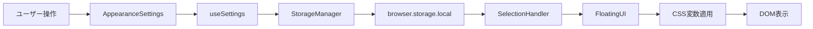

# title: 選択テキスト翻訳フォントサイズ設定機能

## 概要
- 選択テキスト翻訳のFloatingUIに表示される翻訳結果のフォントサイズを、ユーザーが自由に調整できる機能を実装する
- オプション画面（Appearanceセクション）にスライダーを追加し、10px～24pxの範囲で設定可能にする

### goal
- ユーザーが選択翻訳の表示フォントサイズを好みに合わせて調整し、読みやすさを向上できる
- ページ全体翻訳のフォントサイズ設定とは独立して、選択翻訳専用の設定を持つ

## 必須のルール
- 必ず `CLAUDE.md` を参照し、ルールを守ること

## 開発のゴール
- `selectionFontSize`ストレージキーを新規追加し、ページ全体翻訳用の`fontSize`とは独立した設定を実現する
- CSS変数（`--selection-font-size`）を使用して、FloatingUIのフォントサイズを動的に制御する
- 既存の設定UIパターンに従い、一貫性のあるユーザー体験を提供する

## 実装仕様

### 技術仕様
| 項目 | 仕様 |
|------|------|
| **ストレージキー** | `selectionFontSize` |
| **デフォルト値** | `14px` |
| **範囲** | `10px` ～ `24px` (2px刻み) |
| **UI配置** | AppearanceSettings（Appearanceセクション） |
| **CSS適用方法** | CSS変数 `--selection-font-size` |
| **キャッシュ戦略** | SelectionHandler内で初回キャッシュ + 変更監視 |

### アーキテクチャ設計

#### データフロー


#### CSS適用方法（推奨: CSS変数）
```typescript
// iconBadge.ts - FloatingUI生成時
const fontSize = await this.getSelectionFontSize();
floatingElement.style.setProperty('--selection-font-size', `${fontSize}px`);
```

```css
/* content.css */
.gemini-translate-floating-result .translated-text {
  font-size: var(--selection-font-size, 14px);
}
```

### 影響範囲
| カテゴリ | ファイル数 | 変更内容 |
|---------|-----------|---------|
| **型定義** | 1 | `StorageData`に`selectionFontSize`追加 |
| **定数** | 1 | `STORAGE_KEYS`, `UI_CONFIG`に定数追加 |
| **UIコンポーネント** | 1 | `AppearanceSettings`にスライダー追加 |
| **Content Script** | 2 | `iconBadge.ts`, `selectionHandler.ts`修正 |
| **CSS** | 1 | `content.css`にCSS変数追加 |
| **テスト** | 4 | ユニットテスト、統合テスト更新 |
| **合計** | 10 | - |

### リスク評価
| リスク項目 | レベル | 緩和策 |
|-----------|--------|--------|
| **既存機能への影響** | **Low** | 別キー名使用、後方互換性100% |
| **パフォーマンス低下** | **Low** | キャッシュ実装、非同期読み込み |
| **UI崩れ** | **Medium** | 上限24px設定、バリデーション実装 |
| **ブラウザ互換性** | **Low** | CSS変数は広くサポート済み |

## 生成AIの学習用コンテキスト

### 型定義
- `src/shared/types/index.ts`
  - `StorageData`インターフェース（行18-40）
  - `DEFAULT_STORAGE`定数（行42-52）

### ストレージ管理
- `src/shared/storage/StorageManager.ts`
  - `get()`メソッド（デフォルト値マージ）
  - `set()`メソッド（部分更新）

### UIコンポーネント
- `src/options/components/LanguageSettings.tsx`
  - フォントサイズスライダーの実装パターン（行51-80）
  - プレビュー機能の実装パターン

### Content Script
- `src/content/iconBadge.ts`
  - `createFloatingResultElement()`メソッド（行217-300）
  - FloatingUI生成ロジック
- `src/content/selectionHandler.ts`
  - 選択翻訳のメインロジック
  - `translateSelection()`メソッド

### CSS
- `src/styles/content.css`
  - `.gemini-translate-floating-result`スタイル（行106-127）
  - ダークモード対応パターン

## Process

### process1: 型定義とストレージ設定
@target: `src/shared/types/index.ts`
@ref: なし

- [ ] `StorageData`インターフェースに`selectionFontSize?: number`を追加
- [ ] `DEFAULT_STORAGE`に`selectionFontSize: 14`を追加
- [ ] 型エクスポートの整合性を確認

#### sub1-1: 定数定義の追加
@target: `src/shared/constants/config.ts`
@ref: なし

- [ ] `STORAGE_KEYS`に`SELECTION_FONT_SIZE: 'selectionFontSize'`を追加
- [ ] `UI_CONFIG`に以下を追加:
  - `DEFAULT_SELECTION_FONT_SIZE: 14`
  - `MIN_SELECTION_FONT_SIZE: 10`
  - `MAX_SELECTION_FONT_SIZE: 24`

### process2: UIコンポーネント実装
@target: `src/options/components/AppearanceSettings.tsx`
@ref: `src/options/components/LanguageSettings.tsx`（スライダーパターン参考）

- [ ] `AppearanceSettingsProps`に`selectionFontSize: number`を追加
- [ ] `onChange`の型定義に`'selectionFontSize'`を追加
- [ ] スライダーUIを実装:
  - ラベル: "Selection Translation Font Size: {value}px"
  - range input（min: 10, max: 24, step: 2）
  - プレビューテキスト表示
- [ ] ダークモード対応のスタイリング

#### sub2-1: useSettingsフック更新
@target: `src/options/hooks/useSettings.ts`
@ref: なし

- [ ] `SettingsState`型に`selectionFontSize`が含まれることを確認
  - ※ `StorageData`を継承しているため自動的に含まれる
- [ ] 初期ロード時に`selectionFontSize`が正しく読み込まれることを確認

### process3: CSS変数とスタイル適用
@target: `src/styles/content.css`
@ref: なし

- [ ] `.gemini-translate-floating-result .translated-text`のスタイルを修正:
  ```css
  font-size: var(--selection-font-size, 14px);
  ```
- [ ] ダークモードでも正しく表示されることを確認

#### sub3-1: FloatingUI生成時のCSS変数設定
@target: `src/content/iconBadge.ts`
@ref: `src/shared/storage/StorageManager.ts`

- [ ] `showTranslationResult()`メソッド内でストレージから`selectionFontSize`を取得
- [ ] FloatingUI要素に`--selection-font-size`CSS変数を設定:
  ```typescript
  floatingElement.style.setProperty('--selection-font-size', `${fontSize}px`);
  ```
- [ ] デフォルト値（14px）が正しく適用されることを確認

### process4: キャッシュロジック実装
@target: `src/content/selectionHandler.ts`
@ref: なし

- [ ] `SelectionHandler`クラスに`selectionFontSizeCache: number | null`プロパティを追加
- [ ] `getSelectionFontSize()`メソッドを実装:
  - キャッシュがあればそれを返す
  - なければStorageManagerから取得してキャッシュ
- [ ] `browser.storage.onChanged`リスナーを追加してキャッシュ無効化
  ```typescript
  if (changes.selectionFontSize) {
    this.selectionFontSizeCache = null;
  }
  ```

### process10: ユニットテスト
@target: `tests/unit/options/hooks/useSettings.test.ts`
@ref: 既存のfontSizeテストパターン

- [ ] `selectionFontSize`の更新テストを追加
- [ ] デフォルト値（14）が正しく読み込まれることを確認
- [ ] 値の範囲（10-24）が正しくバリデーションされることを確認

#### sub10-1: AppearanceSettingsコンポーネントテスト
@target: `tests/unit/options/components/AppearanceSettings.test.tsx`（新規作成）
@ref: なし

- [ ] スライダーが正しくレンダリングされることを確認
- [ ] `onChange`が正しく呼ばれることを確認
- [ ] プレビューテキストのフォントサイズが動的に変わることを確認

#### sub10-2: IconBadgeテスト更新
@target: `tests/unit/content/iconBadge.test.ts`
@ref: なし

- [ ] FloatingUI生成時にCSS変数が設定されることを確認
- [ ] デフォルト値が正しく適用されることを確認
- [ ] 不正な値（負数、巨大数値）がバリデーションされることを確認

#### sub10-3: 統合テスト
@target: `tests/integration/settings-sync.test.ts`
@ref: なし

- [ ] オプション画面で設定変更 → ストレージ保存 → Content Scriptで読み込み の一連のフローをテスト
- [ ] 複数のFloatingUIが同時表示される場合の動作を確認

### process100: リファクタリング
- [ ] コードの重複を排除
- [ ] 型定義の整合性を確認
- [ ] エラーハンドリングの統一
- [ ] パフォーマンス最適化（必要に応じて）

### process200: ドキュメンテーション
@target: `CLAUDE.md`
@ref: なし

- [ ] Appearanceセクションに選択翻訳フォントサイズ設定の説明を追加
- [ ] CSS変数の使用方法を記載
- [ ] ストレージスキーマの変更を記録

#### sub200-1: アーキテクチャドキュメント更新
@target: `docs/ARCHITECTURE.md`（存在する場合）
@ref: なし

- [ ] ストレージスキーマに`selectionFontSize`を追加
- [ ] データフロー図を更新
- [ ] CSS変数の設計思想を記載
