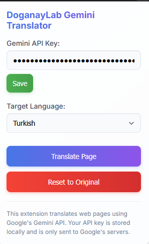
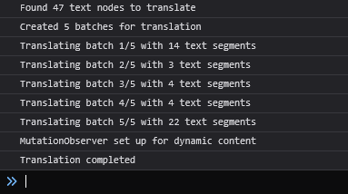
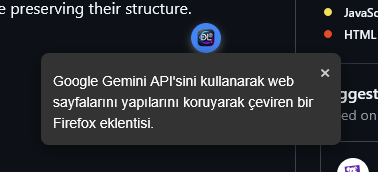

# Gemini Translator Firefox Extension

A Firefox extension that uses the Google Gemini API to translate web pages while preserving their structure.

  

## Features
- **User API Key Management**: Users can enter their own Gemini API keys through the popup interface, and these keys are stored locally.
- **Free Translation Using Google's Free API**: Translate for free by utilizing Google's free API. Unlike other AI translation extensions available in extension stores, you can enjoy translation at no cost.
- **Full Page Translation**: Translates all text on the page while maintaining its layout.
- **Language Selection**: Allows users to choose the target language for translation.
- **Revert to Original Content**: Users can switch the page back to its original content.
- **Dynamic Content Support**: Uses MutationObserver to detect and translate dynamically loaded content.
- **Custom Element Translation**: Translates custom elements such as input placeholders, button texts, and alt texts.
- **Translation Caching**: Caches translations to reduce API calls.
- **Batch Processing**: Employs batch processing for efficient handling of large pages.

## Installation

1. Download or clone this repository.
2. Open Firefox and navigate to `about:debugging`.
3. Click on the "This Firefox" option.
4. Click on "Load Temporary Add-on...".
5. Select any file within the extension directory.

## Usage

1. Click the extension icon in the toolbar to open the popup.
2. Enter your Gemini API key and click the "Save" button.
3. Select the target language.
4. Click the "Translate Page" button to translate the current page.
5. Click the "Reset to Original" button to restore the original content.
6. Translation may be a bit slow—try not to leave the tab. If the full page translation does not complete, click the "Translate Page" button again. The already translated portions are cached, so only the remaining parts will be processed.

## Obtaining a Gemini API Key

1. Go to [Google AI Studio](https://makersuite.google.com/app/apikey).
2. If you don't have an account, create one.
3. Generate a new API key.
4. Copy the API key and paste it into the extension's popup.

## Privacy

- Your API key is stored locally in your browser and is not sent to any server other than Google's Gemini API.
- The extension only sends the text content of web pages to the Gemini API for translation.
- No user data is collected or stored by the extension.

## Technical Details

- Uses the Gemini 2.0 Flash model for fast and accurate translations.
- Employs batch processing to handle large pages efficiently.
- Caches translations to reduce API calls.
- Preserves the structure and functionality of the page during translation.
- Uses MutationObserver to detect and translate dynamic content.
- Only translates meaningful text, skipping single-character texts or numbers.
- Excludes invisible elements (hidden, with visibility set to hidden, or with zero opacity) from translation.
- Excludes special elements such as script, style, iframe, and code from translation.

---

Ready to break language barriers? Let this extension do the heavy lifting while you focus on exploring new horizons—happy translating!

# Gemini Çevirmen Firefox Eklentisi

Google Gemini API'sini kullanarak web sayfalarının yapısını koruyarak çeviri yapan bir Firefox eklentisi.

  

## Özellikler
- **Kullanıcı API Anahtarı Yönetimi**: Kullanıcılar kendi Gemini API anahtarlarını popup arayüzü üzerinden girebilir ve bu anahtar yerel olarak saklanır.
- **Google'ın Sunduğu Ücretsiz API'yi kullanarak ücretsiz olarak çeviri yapın.** Böylece eklenti mağazalarındaki diğer ai çeviri eklentilerinden farklı olarak ücretsiz olarak çeviri yapabilirsiniz.

- **Tam Sayfa Çeviri**: Sayfa yapısını koruyarak sayfadaki tüm metinleri çevirir.
- **Dil Seçimi**: Kullanıcıların çeviri için hedef dili seçmelerine olanak tanır.
- **Orijinal İçeriğe Dönüş**: Kullanıcılar sayfayı orijinal içeriğine geri döndürebilir.
- **Dinamik İçerik Desteği**: Dinamik olarak yüklenen içeriği algılamak ve çevirmek için MutationObserver kullanır.
- **Özel Öğe Çevirisi**: Input placeholder'ları, buton metinleri ve alt metinleri gibi özel öğeleri çevirir.
- **Çeviri Önbelleği**: API çağrılarını azaltmak için çevirileri önbelleğe alır.
- **Toplu İşleme**: Büyük sayfaları verimli bir şekilde işlemek için toplu işleme uygular.

## Kurulum

1. Bu depoyu indirin veya klonlayın
2. Firefox'u açın ve `about:debugging` adresine gidin
3. "Bu Firefox" seçeneğine tıklayın
4. "Geçici Eklenti Yükle..." seçeneğine tıklayın
5. Eklenti dizinindeki herhangi bir dosyayı seçin

## Kullanım

1. Popup'ı açmak için araç çubuğundaki eklenti simgesine tıklayın
2. Gemini API anahtarınızı girin ve "Kaydet" düğmesine tıklayın
3. Hedef dili seçin
4. Mevcut sayfayı çevirmek için "Sayfayı Çevir" düğmesine tıklayın
5. Orijinal içeriği geri yüklemek için "Orijinale Sıfırla" düğmesine tıklayın
6. Çeviri biraz yavaş olabilir sekmeyi terketmemeye gayret edin eğer tam sayfa çeviri alamadıysanız tekrardan Sayfayı çevir butonuna tıklayın önceki kısım önbelleğe alındığı için API isteği göndermeyecek sadece kalan kısmı çevirecektir.

## Gemini API Anahtarı Alma

1. [Google AI Studio](https://makersuite.google.com/app/apikey) adresine gidin
2. Hesabınız yoksa bir hesap oluşturun
3. Yeni bir API anahtarı oluşturun
4. API anahtarını kopyalayın ve eklentinin popup'ına yapıştırın

## Gizlilik

- API anahtarınız yerel olarak tarayıcınızda saklanır ve Google'ın Gemini API'si dışında hiçbir sunucuya gönderilmez
- Eklenti, çeviri için yalnızca web sayfalarının metin içeriğini Gemini API'ye gönderir
- Eklenti tarafından hiçbir kullanıcı verisi toplanmaz veya saklanmaz

## Teknik Detaylar

- Hızlı ve doğru çeviriler için Gemini 2.0 Flash modelini kullanır
- Büyük sayfaları verimli bir şekilde işlemek için toplu işleme uygular
- API çağrılarını azaltmak için çevirileri önbelleğe alır
- Çeviri sırasında sayfa yapısını ve işlevselliğini korur
- Dinamik içeriği algılamak ve çevirmek için MutationObserver kullanır
- Yalnızca anlamlı metinleri çevirir, tek karakterli metinleri veya sayıları atlar
- Görünmeyen öğeleri (gizli, görünürlüğü gizli veya opaklığı sıfır olan) çeviriden hariç tutar
- Script, style, iframe ve code gibi özel öğeleri çeviriden hariç tutar

---

Dil engellerini aşmaya hazır mısınız? Siz yeni ufukları keşfetmeye odaklanırken bu eklentinin ağır işi yapmasına izin verin - çeviride başarılar!